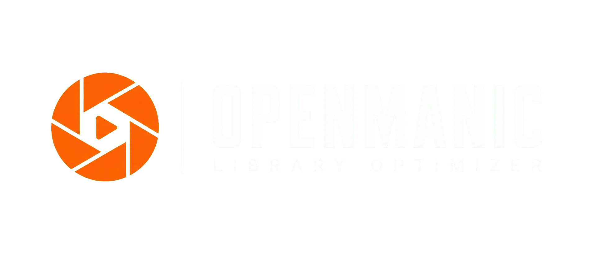

Openmanic - Library Optimiser  
===========================



Openmanic is a fork of [Unmanic](https://github.com/Josh5/unmanic) by Josh Sunnex, with all locally-enforced supporter-tier restrictions removed so every feature implemented in this repository works for everyone. It is not created, endorsed, or supported by the original Unmanic maintainers. See [Migrating from Unmanic](#migrating-from-unmanic) below.

[](https://github.com/nyakuoff/openmanic/releases)
[](https://github.com/nyakuoff/openmanic/issues?q=is%3Aopen+is%3Aissue)
[](https://github.com/nyakuoff/openmanic/issues?q=is%3Aissue+is%3Aclosed)
[](https://github.com/nyakuoff/openmanic/pulls?q=is%3Aopen+is%3Apr)
[](https://github.com/nyakuoff/openmanic/pulls?q=is%3Apr+is%3Aclosed)

[](https://hub.docker.com/r/openmanic/openmanic)
<!-- TODO(openmanic): Docker Hub image not yet published -->
[](https://hub.docker.com/r/openmanic/openmanic)
[](https://hub.docker.com/r/openmanic/openmanic)


[](https://github.com/nyakuoff/openmanic/actions/workflows/python_lint_and_run_unit_tests.yml?query=branch%3Amaster)
[](https://github.com/nyakuoff/openmanic/actions/workflows/integration_test_and_build_all_packages_ci.yml?query=branch%3Amaster)

[]()
---

Openmanic is a simple tool for optimising your file library. You can use it to convert your files into a single, uniform format, manage file movements based on timestamps, or execute custom commands against a file based on its file size.

Simply configure Openmanic pointing it at your library and let it automatically manage that library for you.

Openmanic provides you with the following main functions:

- A scheduler built in to scan your whole library for files that do not conform to your configured file presets. Files found requiring processing are then queued.
- A file/directory monitor. When a file is modified, or a new file is added in your library, Openmanic is able to again test that against your configured file presets. Like the first function, if this file requires processing, it is added to a queue for processing.
- A handler to manage running multiple file manipulation tasks at a time.
- A Web UI to easily configure, manage and monitor the progress of your library optimisation.

You choose how you want your library to be.

Some examples of how you may use Openmanic:

- Transcode video or audio files into a uniform format using FFmpeg.
- Identify (and remove if desired) commercials in DVR recordings shortly after they have completed being recorded.
- Move files from one location to another after a configured period of time.
- Automatically execute FileBot rename files in your library as they are added.
- Compress files older than a specified age.
- Run any custom command against files matching a certain extension or above a configured file size.

### Table Of Contents

[Dependencies](#dependencies)

[Screen-shots](#screen-shots)
  * [Dashboard](#dashboard)
  * [File metrics](#file-metrics)
  * [Installed plugins](#installed-plugins)

[Install and Run](#install-and-run)

[License and Contribution](#license-and-contribution)


## Dependencies

 - Python 3.x ([Install](https://www.python.org/downloads/))
 - To install requirements run 'python3 -m pip install -r requirements.txt' from the project root

Since Openmanic can be used for running any commands, you will need to ensure that the required dependencies for those commands are also installed on your system.

## Screen-shots

#### Dashboard:

#### File metrics:

#### Installed plugins:


## Install and Run

Openmanic's install steps are the same as upstream Unmanic's; see the [Unmanic documentation](https://docs.unmanic.app/docs/) for general usage (the underlying application, configuration, and plugin system are unchanged by this fork).

To run from source:

1) Install the Python dependencies listed above then run:
2) Run:
    ```
    # Build and install the project into your home directory
    python3 ./setup.py install --user
    
    # Run Openmanic
    unmanic
    ```
3) Open your web browser and navigate to http://localhost:8888/

## Migrating from Unmanic

Openmanic is fully data-compatible with an existing Unmanic install. It reads and writes the same `~/.unmanic/` config, plugin, and log directories and the same `unmanic.db` database as Unmanic, so existing libraries, linked installations, and plugin settings carry over with no manual migration. Supporter-tier restrictions are removed in Openmanic, so any library/link counts previously blocked by the free-tier limit will simply start working after switching over.

## License and Contribution

This projected is licensed under the GPL version 3. 

Copyright (C) Josh Sunnex - All Rights Reserved

Permission is hereby granted, free of charge, to any person obtaining a copy
of this software and associated documentation files (the "Software"), to deal
in the Software without restriction, including without limitation the rights
to use, copy, modify, merge, publish, distribute, sublicense, and/or sell
copies of the Software, and to permit persons to whom the Software is
furnished to do so, subject to the following conditions:
 
The above copyright notice and this permission notice shall be included in all
copies or substantial portions of the Software.

This project contains libraries imported from external authors.
Please refer to the source of these libraries for more information on their respective licenses.

See [CONTRIBUTING.md](docs/CONTRIBUTING.md) to learn how to contribute to Openmanic.

---
